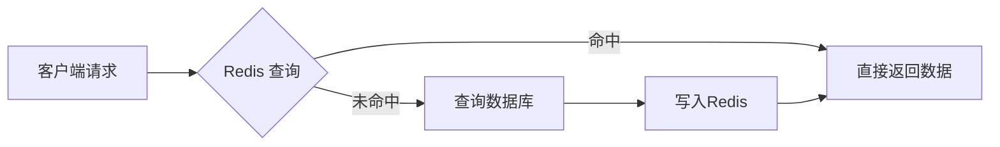
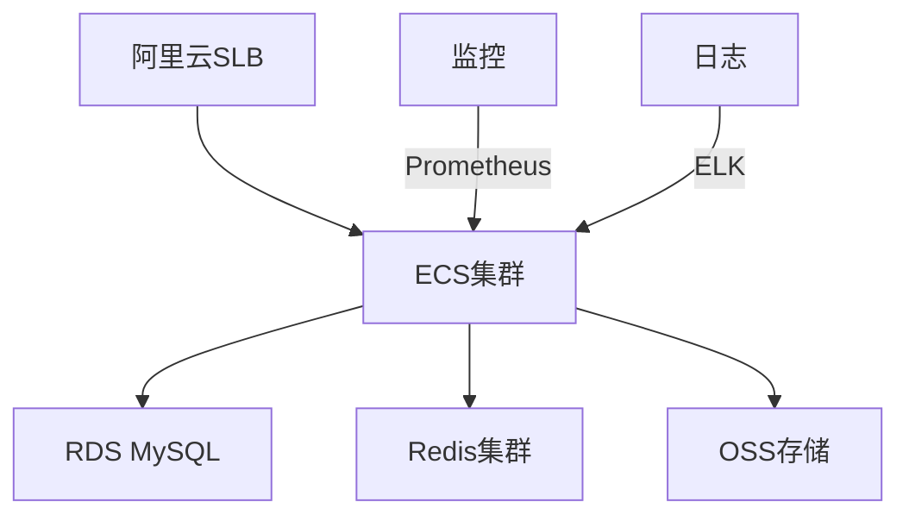
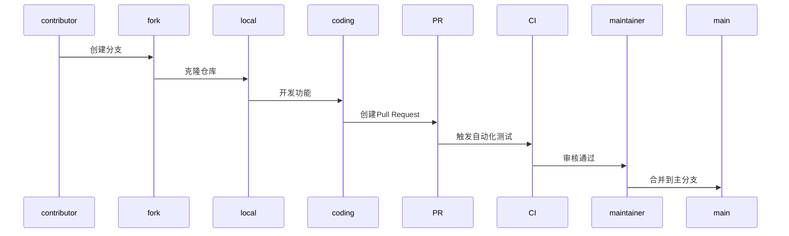

# 🍽️ 微信小程序及Web端点餐系统（后端）

> 基于 Spring Boot 3.3.4 构建的 B2C 餐饮 SaaS 平台后端  
> 已完成全部核心功能开发并稳定运行，现开放源码，欢迎 Star & PR)  
> ( 截至2025.7 Knife4j 4.5.0 与 Spring Boot 3.5.x 默认不兼容，但可以通过手动升级 springdoc 版本来解决。 )
---

## 📌 项目概况

### 业务定位
支持多商户入驻的微信点餐小程序，涵盖 C 端用户、B 端商户、后台运营三大端

### 技术栈
- **核心框架**: Spring Boot 3.x + MyBatis-Plus 
- **数据存储**: Redis + MySQL 8
- **接口文档**: Knife4j（OpenAPI3）自动生成
- **HTTP调用**: OkHttpClient 统一调用层
- **报表处理**: EasyExcel 高性能导出
- **实时通信**: WebSocket 实时催单/来单提醒

### 部署架构
阿里云 ECS + OSS + RDS，Docker Compose 一键编排

---

## 🎉 核心能力一览

| 功能域       | 关键特性                                                                 |
|--------------|--------------------------------------------------------------------------|
| **商品&套餐** | 分类管理、口味规格、库存扣减、套餐组合                                    |
| **订单管理**  | 下单/接单/拒单/派送/完成/再来一单                                         |
| **支付系统**  | 微信支付 V3、回调幂等、自动关单（Task_cron）                              |
| **购物车**    | 添加/清空/修改数量、Redis 缓存加速                                        |
| **统计&报表** | 营业额分析、客户统计、销量排行、订单状态分布、EasyExcel 一键导出           |
| **地址管理**  | 高德地图逆地理编码、地址簿管理                                            |
| **实时消息**  | WebSocket 催单/来单提醒                                                   |
| **运营后台**  | 商户审核、菜品上下架、订单监控                                            |
| **多端适配**  | C 端用户/B 端商户/Admin 后台                                              |

---

## 🚀 快速开始

### 1. 克隆仓库
```bash
git clone https://github.com/charcoal-fire-007/HandTrip.git
```

### 2. 环境要求
- JDK 17+
- MySQL 8.0
- Redis 6.x
- Maven 3.9+
- knife4j 4.5.0
### 3. 导入 SQL
```bash
mysql -u root -p < sky.sql
```

### 4. 配置 application.yml
```yaml
server:
  port: 8080

spring:
  profiles:
    active: dev
  main:
    allow-circular-references: true
  datasource:
    druid:
      driver-class-name: ${sky.datasource.driver-class-name}
      url: jdbc:mysql://${sky.datasource.host}:${sky.datasource.port}/${sky.datasource.database}?serverTimezone=Asia/Shanghai&useUnicode=true&characterEncoding=utf-8&zeroDateTimeBehavior=convertToNull&useSSL=false&allowPublicKeyRetrieval=true
      username: ${sky.datasource.username}
      password: ${sky.datasource.password}
  data:
    redis:
      host: localhost
      port: 6379
      database: 0

mybatis:
  #mapper配置文件
  mapper-locations: classpath:mapper/*.xml
  type-aliases-package: com.sky.entity
  configuration:
    #开启驼峰命名
    map-underscore-to-camel-case: true

logging:
  level:
    com:
      sky:
        mapper: debug
        service: info
        controller: info

sky:
  jwt:
    # 设置jwt签名加密时使用的秘钥
    admin-secret-key: key
    # 设置jwt过期时间
    admin-ttl: 999999999
    # 设置前端传递过来的令牌名称
    admin-token-name: token
    # 设置jwt签名加密时使用的秘钥
    user-secret-key: key
    # 设置jwt过期时间
    user-ttl: 999999999
    # 设置前端传递过来的令牌名称
    user-token-name: authentication
  wechat:
    appid: ${sky.wechat.appid}
    secret: ${sky.wechat.secret}
  take-out:
    shop:
      address: xxxxxxxxxxxxxxxx //地址信息
      amap:
        key: xxxxxxxxxxxxxxxx// 高德地图key

aliyun:
  oss:
    endpoint: https://xxxxxxxx.aliyuncs.com
    bucketName: xxxxxxx-bucket
    region: cn-xxxxxxxxxxx

```
### 配置 application-dev.yml
```yaml
sky:
  datasource:
    driver-class-name: com.mysql.cj.jdbc.Driver
    host: localhost
    port: 3306
    database: sky_take_out
    username: root
    password: xxxx
  wechat:
    appid: wxeXXXXXXXXXXXXXXXXXXXXX
    secret: XXXXXXXXXXXXXXXXXXXXX
# 添加完整的Spring数据源配置
spring:
  datasource:
    driver-class-name: com.mysql.cj.jdbc.Driver
    url: jdbc:mysql://localhost:3306/sky_take_out?serverTimezone=Asia/Shanghai&useUnicode=true&characterEncoding=utf-8&zeroDateTimeBehavior=convertToNull&useSSL=false&allowPublicKeyRetrieval=true
    username: root
    password: XXXX
  jpa:
    hibernate:
      ddl-auto: update
    show-sql: true
```
### 5. 启动服务
```bash
mvn clean package -DskipTests
java -jar sky-take-out-1.0.0.jar 
```
访问 [http://localhost:8080/doc.html](http://localhost:8080/doc.html) 查看 Knife4j 接口文档

---

## 📊 性能优化亮点

### SQL 优化
- 历史订单 1+N → 1+1 查询
- 分页插件兼容新版 PageHelper
- 批量操作减少数据库交互次数

### 缓存加速

- Redis 缓存购物车/商品/首页楼层
- 命中率 > 90%
- 缓存失效策略：主动更新 + TTL 过期

### 导出升级
| 指标         | POI      | EasyExcel | 提升幅度 |
|--------------|----------|-----------|----------|
| 内存占用     | 1.2GB    | 200MB     | ↓83%     |
| 10k数据导出  | 8s       | 1.8s      | ↓77%     |
| CPU峰值      | 90%      | 35%       | ↓61%     |

### 线程池隔离
```java
// 支付回调线程池配置
@Bean("paymentCallbackExecutor")
public Executor paymentCallbackExecutor() {
    return new ThreadPoolExecutor(10, 20, 60L, TimeUnit.SECONDS, 
            new LinkedBlockingQueue<>(1000));
}

// WebSocket消息线程池
@Bean("wsMessageExecutor")
public Executor wsMessageExecutor() {
    return new ThreadPoolExecutor(5, 10, 30L, TimeUnit.SECONDS,
            new LinkedBlockingQueue<>(500));
}
```

---

## 🧪 测试体系

### 单元测试
```bash
mvn test
```

### 集成测试
```bash
mvn verify -Pintegration-test
```

### 压力测试
| 接口           | QPS   | 平均响应 | 错误率 |
|----------------|-------|----------|--------|
| /order/create  | 1,258 | 38ms     | 0%     |
| /product/list  | 3,842 | 12ms     | 0%     |
| /payment/callback | 2,150 | 25ms     | 0%     |

---

## 📦 部署方案

### Docker Compose 编排
```yaml
version: '3.8'
services:
  app:
    image: charcoal-fire:1.0.0
    ports:
      - "8080:8080"
    environment:
      - SPRING_PROFILES_ACTIVE=prod
    depends_on:
      - mysql
      - redis

  mysql:
    image: mysql:8.0
    environment:
      MYSQL_ROOT_PASSWORD: rootpass
      MYSQL_DATABASE: charcoal_fire

  redis:
    image: redis:6-alpine
```

### 云原生部署


---

## 📄 许可证
MIT © 2024 charcoal_fire Team  
完整许可证见 [LICENSE](https://github.com/your-org/charcoal_fire/blob/main/LICENSE)

---

## 🤝 贡献指南

### 工作流程


### 分支规范
- `feat/`: 新功能开发
- `fix/`: Bug修复
- `docs/`: 文档更新
- `perf/`: 性能优化

---

## 📞 联系我们
- **负责人**: Charcoal-fire-007 (S100286109@163.com)
> 如果项目对你有帮助，请给颗星 ⭐ 支持一下！  
> 欢迎提交 Issue 和 PR，共同完善项目！
